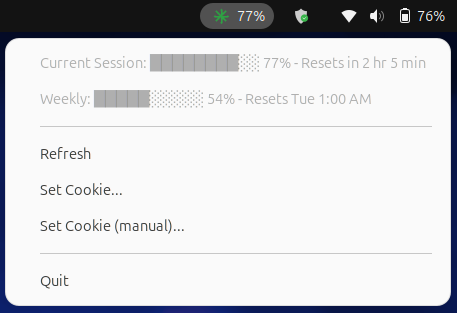
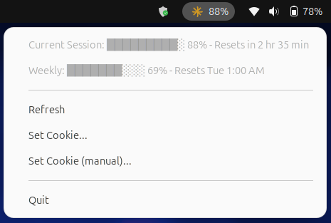
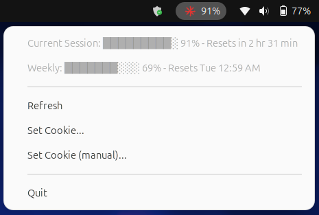

# claudebar


A lightweight Linux system tray app that shows your claude.ai usage limits at a glance — your **session window** and your **weekly window** — without leaving the tray.

> **Unofficial.** This is a community project, not affiliated with or endorsed by Anthropic. It reads the same private endpoint the claude.ai usage page uses, authenticated with **your own** session cookie. The endpoint is undocumented and may change or break without notice. Use at your own discretion.

Inspired by the macOS project [claude-usage-bar](https://github.com/tmatteozzi/claude-usage-bar).

| Green (<80%) | Yellow (≥80%) | Red (≥90%) |
|:---:|:---:|:---:|
|  |  |  |

## Features

- Tray icon with live **session usage %**, color-coded (green / yellow ≥80% / red ≥90%).
- Menu shows **session** and **weekly** usage with reset times.
- Cookie auto-detected from your browser, or pasted manually.
- Auto-refreshes every 5 minutes.
- Cookie stored only via your OS keyring — never in plaintext.
- Autostarts at login via `~/.config/autostart/claudebar.desktop`.

## Requirements

- Python 3.10+, [Poetry](https://python-poetry.org/docs/#installation), a claude.ai account.
- A secret-storage backend for `keyring` — `gnome-keyring` (GNOME) or `kwallet` (KDE). claudebar refuses to store cookies on an insecure fallback backend.
- **GNOME users:** install the [AppIndicator](https://extensions.gnome.org/extension/615/appindicator-support/) extension, otherwise the tray icon won't render at all.

## Install

```sh
git clone <this-repo>
cd claudebar
./install.sh
```

This installs the Python dependencies via Poetry and writes an autostart entry. claudebar will start at your next login, or you can launch it immediately:

```sh
make run
```

Add `&` at the end to run it in the background and free up the terminal.

## First run — set your cookie

### Automatic (recommended)

Click **Set Cookie...** in the tray menu. claudebar reads the session cookie directly from your browser's storage (Chrome, Chromium, Brave, Edge, Firefox) — no DevTools needed. Falls back to the manual flow if no browser has a usable session.

### Manual

1. Open **claude.ai/settings/usage**, open DevTools (`F12`) → **Network** tab → reload.
2. Click the **`usage`** request → **Request Headers** → copy the full **`Cookie`** value.
3. In claudebar's tray menu, click **Set Cookie (manual)...**, paste it, and confirm.

The cookie must include `sessionKey`. It's stored only in your OS keyring. When the menu shows "Cookie expired", repeat either flow with a fresh one. Without `zenity`, the manual flow reads from stdin instead — run `poetry run python3 -m claudebar` from a terminal.

## Uninstall

```sh
./uninstall.sh
```

This removes the autostart entry, the lockfile, and the stored cookie from your keyring.

## Limitations

- Uses the **private**, undocumented claude.ai usage endpoint — may change without notice.
- Reports utilization **percentages and reset times**, not raw token counts.
- No multi-organization selector.

## License

See [LICENSE](LICENSE).
